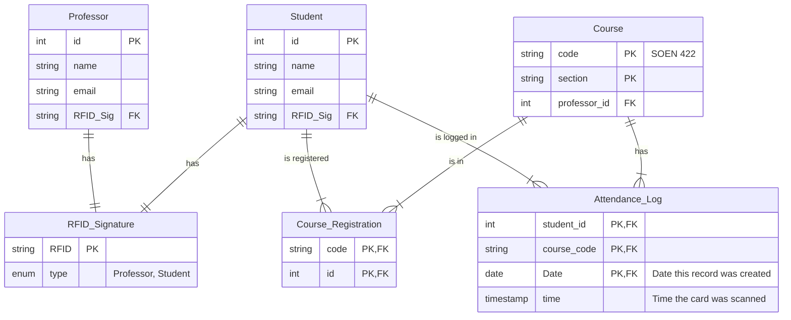

```mermaid
erDiagram
    
    RFID_Signature {
      string RFID PK
      enum type "Professor, Student"
    }

    Professor ||--|| RFID_Signature : has
    Professor {
      int id PK
      string name
      string email
      string RFID_Sig FK
    }

    Student ||--|| RFID_Signature : has
    Student ||--|{ Course_Registration : "is registered"
    Student ||--|{ Attendance_Log : "is logged in"
    Student {
      int id PK
      string name
      string email
      string RFID_Sig FK
    }

    Course ||--|{ Attendance_Log : "has"
    Course ||--|{ Course_Registration : "is in"
    Course {
      string code PK "SOEN 422"
      string section PK
      int professor_id FK
    }

    Course_Registration {
      string code PK,FK
      int id PK,FK
    }

    Attendance_Log {
      int student_id PK,FK
      string course_code PK,FK
      date Date PK,FK "Date this record was created"
      timestamp time "Time the card was scanned"
    }

```